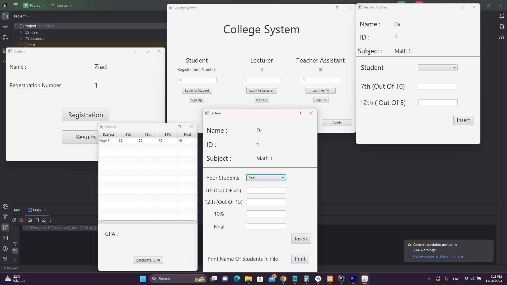

# College System Project

This Java and JavaFX project implements a college system that includes features for administrators, lecturers, teacher assistants, and students. The system allows administrators to manage subjects, lecturers, and teacher assistants. Lecturers and teacher assistants can sign up, sign in, add marks and results to students, and manage subjects. Students can sign up, register in subjects, view their results, and calculate GPA.

## Preview

## Demo Video

Watch a demo of the College System Project in action! Click the image above to view the video.

## Features

### Administrator

- Add subjects to the system.
- Subject information (name, semester, credit hours, code).

### Lecturers and Teacher Assistants

- Sign up with name, ID, semester, and subject.
- Sign in with ID to view personal information.
- Add marks and results to students.

### Students

- Sign up with their name and registration number.
- Sign in with a registration number to view personal information.
- Register in subjects.
- View results when available.
- Calculate GPA.

## Database

The project uses a MySQL relational database to store and manage information.

